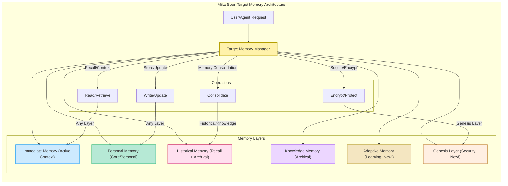

**Letta vs Mika Seon Memory Architecture**

| Memory Layer | Letta Current | Mika Seon Target | Changes Needed |
|--------------|---------------|------------------|----------------|
| **Immediate** | Active Context | Immediate Memory | ✅ Similar |
| **Personal** | Core Memory | Personal Memory | ✅ Similar |
| **Historical** | Recall Memory + Archival | Historical Memory | Local storage, encryption |
| **Knowledge** | Archival Memory | Knowledge Memory | Local storage, user control |
| **Learning** | ❌ None explicit | Adaptive Memory | 🆕 **New layer needed** |
| **Security** | ❌ Basic | Genesis Layer | 🆕 **New layer needed** |

**Storage Architecture:**
| Aspect | Letta | Mika Seon |
|--------|-------|-----------|
| Location | Cloud/Server | Local-first |
| Encryption | Basic | End-to-end |
| User Control | Limited | Full ownership |
| Offline | ❌ No | ✅ Yes |

# Mika Seon Agent Architecture

**Layer Descriptions:**
- **Immediate Memory:** Holds active conversational context.
- **Personal Memory:** Stores user-specific facts, preferences, and core personal data.
- **Historical Memory:** Archives long-term interactions and events; requires local storage and encryption.
- **Knowledge Memory:** Persistent facts and general knowledge; user-controlled, locally stored.
- **Adaptive Memory:** Supports learning, pattern recognition, and continuous improvement.
- **Genesis Layer:** Foundation for privacy, security, and integrity controls.

> This diagram and table align Letta's current memory architecture with the enhanced Mika Seon Target layer model, highlighting changes and new capabilities.

Key Principles:
🔒 Local-first storage    🔐 End-to-end encryption    👤 User ownership